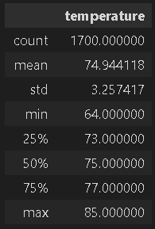

# SURFS UP!
## Overview
Using SQLite and Flask, analysis on weather data was performed on weather observations to determine how well suited an island in Hawaii would be suited to support a combination surf and ice cream shop.  
## Results
Data for June and December were analyzed for the following:
- average temperature
- standard deviation of the temperature
- minimum temperature
- maximum temperture
- quartiles of the temperature

June data is as follows:

December data is as follows:

The December has ~200 less data points than the June data and is 5 degrees colder on average.  The biggest difference in the comparison is the minimum temperature difference with December being 8 degrees colder.  

## Summary
Determining if there is any difference between where the station was located geographically on the island would be helpful in determining the best location for the shop.  Due to breeze off of the ocean, one side of the island maybe be warmer and more suitable for the ice cream sales.  Additionally, determining the side of the island with the best waves for surfing and locating the shop there would help surf sales. 

A comparison of the min, max and average temperatures from the 9 obersavation stations was compared as well.  Station USC00517948 appeared to have the highest minimum, maximum, and average so, if the waves were also found to be good in that area as well, a location near that area may be a good choice for the shop. 

